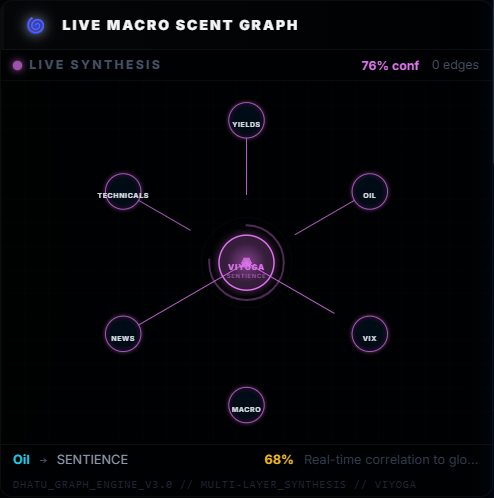
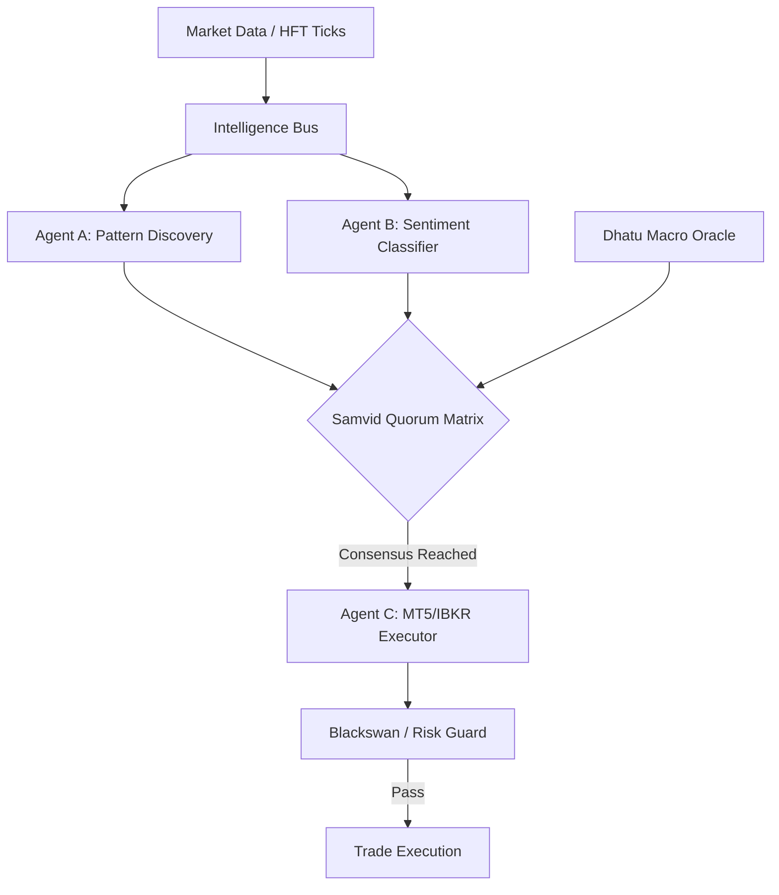

# 🪐 Samvid Trading Core (v1.0-beta)

[](https://github.com/AshishTalpada/samvid-trading-core/actions)
[](https://github.com/AshishTalpada/samvid-trading-core/blob/main/CHANGELOG.md)
[](https://www.python.org/downloads/)
[](https://github.com/astral-sh/ruff)

**Status: v1.0-beta Release | Core Agent Mesh Hardened | Live Demo Active**

**Samvid** (Sanskrit for *Consensus* or *Shared Intelligence*) is an experimental, event-driven trading engine. Developed through multiple research iterations, it utilizes a decentralized mesh of specialized agents that collaborate via a consensus-based voting model to manage trade discovery, macro-analysis, and execution.

---

## 🚀 Live Demonstration

Experience the "Samvid Intelligence Mesh" in action without any external dependencies.

```bash
# Run the live sovereign demonstration
python src/demonstration.py
```

---

## 🖼️ Visualizing the Mesh

### Intelligence Dashboard (v1.0-beta Concept)


### Dhatu Macro-Causation Oracle (State Synthesis)


---

## 🧠 Why I Built This
Samvid was born from a fascination with **Collective Intelligence** and **Macro-Causation**. Traditional trading bots often rely on isolated indicators; I wanted to build a system where execution is the result of a "Committee of Experts" (Agents) reaching a majority consensus. The naming follows Sanskrit philosophical concepts: **Dhatu** (the fundamental elements of market movement) and **Samvid** (the shared knowledge required for high-conviction action).

---

## ⚡ Technical Highlights

*   **Autonomous Agent Mesh**: A decentralized coordination layer where 11 specialized entities (Pattern Atlas, Belief Tracker, etc.) vote on trade signals via an internal Intelligence Bus.
*   **Dhatu Macro Oracle**: A causation engine mapping global yields, volatility (VIX), and energy prices into a 5-state state-machine (Vriddhi, Kshaya, etc.).
*   **Real-time Telemetry**: High-frequency React dashboard providing sub-100ms updates via secured WebSockets and HMAC-SHA256 handshakes.
*   **Security Architecture**: OS-level secure vault for credential management (keyring-based) with a "Zero-Keys" plaintext policy.

---

## 🏗️ Architecture & Data Flow



---

## 🛠️ Technology Stack

| Layer | Technology |
| :--- | :--- |
| **Backend** | Python 3.10+ (Asyncio), FastAPI, Uvicorn |
| **Frontend** | React 18, Vite, Framer Motion, Lightweight Charts |
| **Databases** | QuestDB (Time-series Ticks), SQLite3 (System State) |
| **Security** | OS Vault (keyring), HMAC-SHA256, WebSocket Handshake |

---

## 🚀 Getting Started

### 1. Installation
```bash
# Clone the repository
git clone https://github.com/AshishTalpada/samvid-trading-core.git
cd samvid-trading-core

# Quick Setup via Makefile
make setup
```

### 2. Execution
```bash
# Spin up infrastructure (QuestDB)
make docker-up

# Start the full stack
make dev
```

---

## 🛡️ Limitations & Roadmap
*   **Current State**: The system is currently in **Paper-Trading mode**. Live execution modules for IBKR/MT5 are implemented but undergoing safety audits.
*   **Backtesting**: A high-fidelity backtesting engine leveraging QuestDB's time-series capabilities is in the development roadmap.
*   **ML Integration**: Future versions aim to replace heuristic-based agent voting with a trained reinforcement learning meta-agent.

---

**Disclaimer**: *This project is for educational and research purposes. Algorithmic trading involves substantial risk of loss. Use responsibly.*
