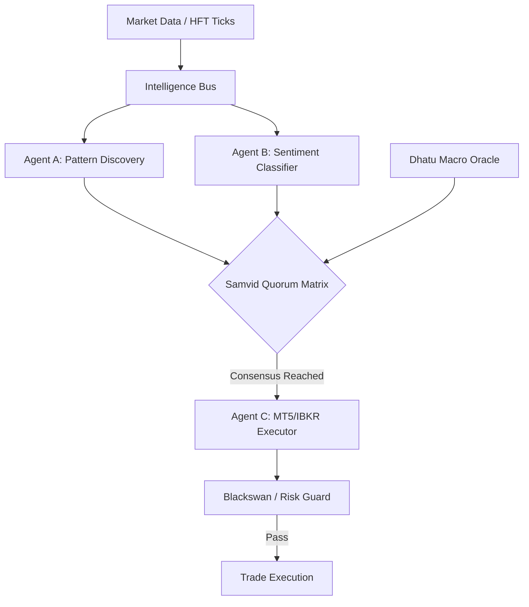
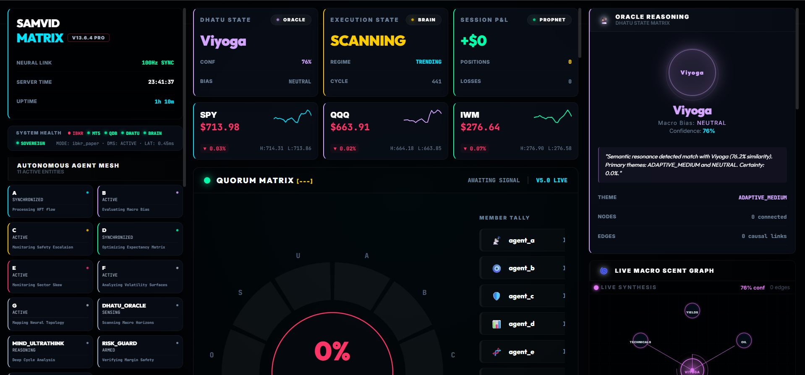

# Samvid Trading Core — Open-Source AI Algorithmic Trading System

[](https://github.com/AshishTalpada/samvid-trading-core/actions)
[](https://github.com/AshishTalpada/samvid-trading-core/releases)
[](https://www.python.org/downloads/)
[](https://www.rust-lang.org/)
[](https://fastapi.tiangolo.com/)
[](https://github.com/astral-sh/ruff)
[](#-test-suite--reliability)
[](LICENSE)

> **Samvid** (Sanskrit: *Consensus / Shared Intelligence*) — An open-source, production-grade **AI multi-agent algorithmic trading system** for Interactive Brokers (IBKR), MetaTrader 5, and TradingView. Built with Python, Rust, FastAPI, and asyncio for institutional-quality automated stock trading, forex execution, and quantitative finance research.

## What is Samvid Trading Core?

**Samvid Trading Core** is a free, open-source algorithmic trading bot and automated trading platform that uses **11 specialized AI agents** working together in a consensus-based mesh to make trading decisions. Unlike monolithic trading bots, Samvid uses a **quorum voting model** — no single agent can execute a trade alone. Pattern recognition, sentiment analysis, macro economics, and risk management must all agree before execution.

### Key Features

- **Multi-Agent AI Trading** — 11 autonomous agents (Pattern Discovery, Belief Tracker, Sentiment Classifier, Macro Oracle, Risk Guard, etc.)
- **Interactive Brokers (IBKR) Integration** — Full order execution, bracket orders, Financial Advisor multi-account support
- **MetaTrader 5 Support** — FTMO challenge-compliant execution with daily loss limits
- **TradingView Real-Time Quotes** — WebSocket-based tick streaming at 100Hz
- **Institutional Risk Management** — Circuit breakers, position sizing (Kelly/fractional), correlation monitoring, Black Swan protection
- **FastAPI Dashboard & WebSocket API** — Real-time telemetry, trade monitoring, operator control
- **Rust Native Acceleration** — PyO3-based native core for latency-critical paths
- **QuestDB Time-Series Database** — Sub-millisecond OHLCV queries for 30+ instruments
- **Numba JIT Math** — Pre-compiled EMA, RSI, ATR, Kalman filters for HFT-speed signal generation
- **Telegram Bot Integration** — Real-time trade alerts, remote command execution
- **Zero-Secrets Architecture** — OS-level credential vault (Windows Credential Manager / macOS Keychain)

### Who Is This For?

- Quantitative traders building automated trading systems
- Developers researching multi-agent AI architectures for finance
- Prop firm traders needing FTMO/funded-account compliance
- Anyone looking for an open-source alternative to commercial algo trading platforms

**Status: v1.0-beta | Research & Paper Trading | Event-Driven Execution**

---

## 🚀 Live Demonstration

Experience the "Samvid Intelligence Mesh" telemetry in a zero-dependency terminal simulation.

```bash
# Run the live sovereign demonstration
python src/demonstration.py
```

---

## 🧠 Architecture Overview

Samvid is designed for modularity and high-frequency event processing:

*   **Autonomous Agent Mesh**: 11 specialized agents (e.g., Pattern Atlas, Belief Tracker) communicate via an internal Intelligence Bus.
*   **Consensus-Based Quorum**: No single agent can execute a trade; a quorum-based matrix ensures that technical, macro, and risk parameters are all satisfied.
*   **Dhatu Macro Oracle**: A causation-focused state machine mapping macro variables (Yields, VIX, Energy) into 5 distinct market regimes (Vriddhi, Sthiti, Kshaya, etc.).
*   **Zero-Keys Security**: Credential management is handled via an OS-level secure vault (keyring) ensuring no plaintext secrets ever touch the disk.

### Data Flow & Quorum


---

## 🖼️ Dashboard Preview


*Live v1.0-beta Intelligence Dashboard showing real-time agent consensus and macro state synthesis.*

---

## 🧪 Test Suite & Reliability

The system is backed by a comprehensive suite of **24 test modules** covering unit, integration, and high-load stress testing:

*   **Stress Testing**: Modules like `stress_test_500k.py` validate the Intelligence Bus under extreme message loads.
*   **Behavioral Logic**: `test_behavioral_logic.py` ensures agents adhere to the consensus protocol.
*   **Risk Invariants**: `test_risk_invariants.py` strictly enforces position sizing and stop-loss rules.
*   **Integration**: End-to-end flows from data ingestion to mock execution are validated in `test_integration.py`.

```bash
# Run the full test suite
pytest tests/
```

---

## 🛠️ Technology Stack

| Layer | Technology |
| :--- | :--- |
| **Language** | Python 3.11+ (Asyncio, type-hinted), Rust (PyO3 native extensions) |
| **Trading APIs** | Interactive Brokers (ib_insync), MetaTrader 5, TradingView WebSocket |
| **Web Framework** | FastAPI + Uvicorn (async REST + WebSocket API) |
| **Frontend** | React 18, Vite, Framer Motion, TradingView Lightweight Charts |
| **Databases** | QuestDB (time-series ticks), SQLite3 (system state), ChromaDB (vector memory) |
| **Math/ML** | NumPy, Polars, Numba JIT, Bayesian inference, Kalman filters |
| **Security** | OS keyring vault, HMAC-SHA256, Fernet AES encryption |
| **Infra** | Docker (QuestDB), systemd/PM2, Telegram Bot API |

---

## 🚀 Getting Started

### 1. Installation
```bash
# Clone the repository
git clone https://github.com/AshishTalpada/samvid-trading-core.git
cd samvid-trading-core

# Quick Setup via Makefile
make setup
```

### 2. Execution
```bash
# Spin up infrastructure (QuestDB)
make docker-up

# Start the full stack
make dev
```

---

## 🌐 Related Projects & Alternatives

If you're looking for algorithmic trading systems, you might also explore:
- [Zipline](https://github.com/quantopian/zipline) — Backtesting library
- [Lean](https://github.com/QuantConnect/Lean) — QuantConnect's algo trading engine
- [FreqTrade](https://github.com/freqtrade/freqtrade) — Crypto trading bot
- [Jesse](https://github.com/jesse-ai/jesse) — Python algo trading framework

**Samvid differentiates** with its multi-agent consensus architecture, IBKR/MT5 dual-broker support, and real-time Rust-accelerated execution path.

---

## 📚 Documentation & Resources

- [Architecture Overview](docs/ARCHITECTURE.md)
- [Agent System Design](docs/AGENTS.md)
- [Risk Management Rules](docs/RISK.md)
- [API Reference (FastAPI)](http://localhost:8000/docs) *(when running)*

---

## 🤝 Contributing

Contributions are welcome! Please read our contributing guidelines before submitting PRs. Areas where help is especially appreciated:
- Additional broker integrations (Alpaca, Binance)
- Backtesting engine improvements
- Frontend dashboard features
- Documentation and tutorials

---

## 🛡️ License

This project is licensed under the **MIT License** — see the [LICENSE](LICENSE) file for details.

---

## ⚠️ Disclaimer

*This software is provided for **research and educational purposes only**. Algorithmic trading involves substantial financial risk. Past performance does not guarantee future results. The authors are not responsible for any financial losses incurred through use of this software. Always paper trade first.*

---

<details>
<summary><strong>SEO Keywords</strong> (for search engine discoverability)</summary>

algorithmic trading system, automated trading bot, AI trading bot python, interactive brokers api python, IBKR automated trading, metatrader 5 python bot, quantitative trading platform, open source trading system, multi-agent trading system, algorithmic trading github, python trading bot, automated stock trading, forex trading bot, trading system architecture, real-time market data python, fastapi trading dashboard, rust trading system, position sizing algorithm, risk management trading, FTMO trading bot, prop firm trading bot, consensus based trading, event driven trading system, asyncio trading, questdb trading, numba trading signals, kalman filter trading, bayesian trading system

</details>

