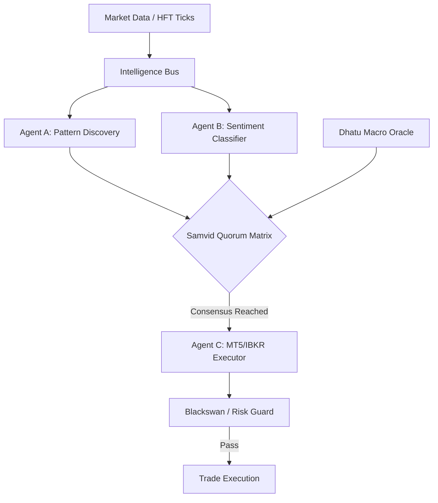
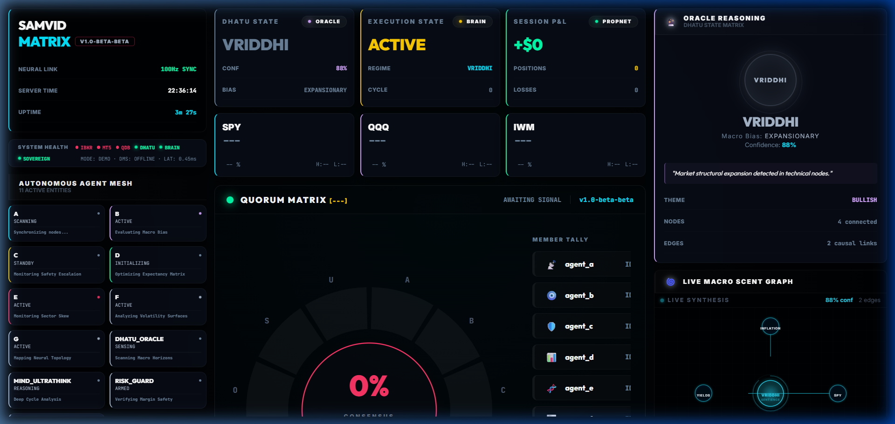

# 🪐 Samvid Trading Core (v1.0-beta)

[](https://github.com/AshishTalpada/samvid-trading-core/actions)
[](https://github.com/AshishTalpada/samvid-trading-core/releases)
[](https://www.python.org/downloads/)
[](https://github.com/astral-sh/ruff)
[](#-test-suite--reliability)

**Status: v1.0-beta | Architecture-First Agent Mesh | Event-Driven Execution**

**Samvid** (Sanskrit for *Consensus* or *Shared Intelligence*) is an experimental, event-driven trading engine built around a decentralized mesh of specialized agents. Instead of a monolithic strategy, execution is the result of a consensus-based voting model where multiple specialized entities (Pattern Discovery, Sentiment, Macro Oracle) reach a quorum before any action is taken.

---

## 🚀 Live Demonstration

Experience the "Samvid Intelligence Mesh" telemetry in a zero-dependency terminal simulation.

```bash
# Run the live sovereign demonstration
python src/demonstration.py
```

---

## 🧠 Architecture Overview

Samvid is designed for modularity and high-frequency event processing:

*   **Autonomous Agent Mesh**: 11 specialized agents (e.g., Pattern Atlas, Belief Tracker) communicate via an internal Intelligence Bus.
*   **Consensus-Based Quorum**: No single agent can execute a trade; a quorum-based matrix ensures that technical, macro, and risk parameters are all satisfied.
*   **Dhatu Macro Oracle**: A causation-focused state machine mapping macro variables (Yields, VIX, Energy) into 5 distinct market regimes (Vriddhi, Sthiti, Kshaya, etc.).
*   **Zero-Keys Security**: Credential management is handled via an OS-level secure vault (keyring) ensuring no plaintext secrets ever touch the disk.

### Data Flow & Quorum


---

## 🖼️ Dashboard Preview


*Live v1.0-beta Intelligence Dashboard showing real-time agent consensus and macro state synthesis.*

---

## 🧪 Test Suite & Reliability

The system is backed by a comprehensive suite of **24 test modules** covering unit, integration, and high-load stress testing:

*   **Stress Testing**: Modules like `stress_test_500k.py` validate the Intelligence Bus under extreme message loads.
*   **Behavioral Logic**: `test_behavioral_logic.py` ensures agents adhere to the consensus protocol.
*   **Risk Invariants**: `test_risk_invariants.py` strictly enforces position sizing and stop-loss rules.
*   **Integration**: End-to-end flows from data ingestion to mock execution are validated in `test_integration.py`.

```bash
# Run the full test suite
pytest tests/
```

---

## 🛠️ Technology Stack

| Layer | Technology |
| :--- | :--- |
| **Backend** | Python 3.10+ (Asyncio), FastAPI, Uvicorn |
| **Frontend** | React 18, Vite, Framer Motion, Lightweight Charts |
| **Databases** | QuestDB (Time-series Ticks), SQLite3 (System State) |
| **Security** | OS Vault (keyring), HMAC-SHA256, WebSocket Handshake |

---

## 🚀 Getting Started

### 1. Installation
```bash
# Clone the repository
git clone https://github.com/AshishTalpada/samvid-trading-core.git
cd samvid-trading-core

# Quick Setup via Makefile
make setup
```

### 2. Execution
```bash
# Spin up infrastructure (QuestDB)
make docker-up

# Start the full stack
make dev
```

---

## 🛡️ License
This project is licensed under the MIT License - see the [LICENSE](LICENSE) file for details.

---

**Disclaimer**: *This project is for research and educational purposes only. Algorithmic trading involves substantial risk. Use responsibly.*

