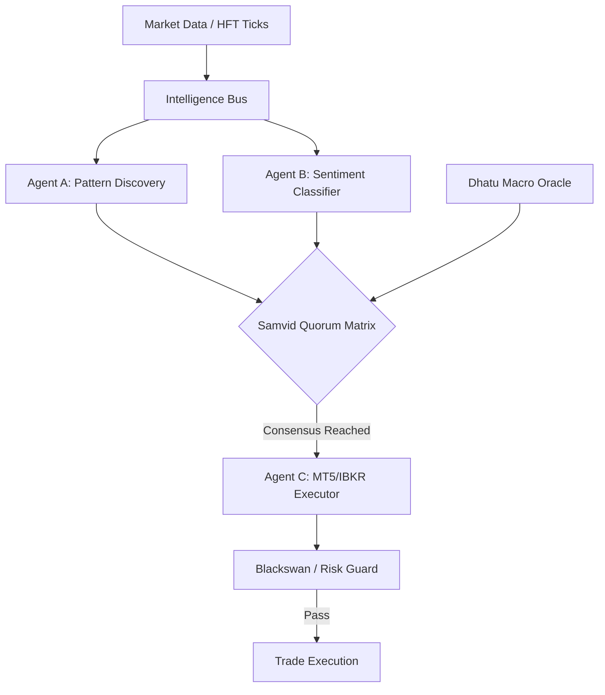

# 🪐 Samvid Trading Core V13.7 (संविद्)

[](https://www.python.org/downloads/)
[](https://reactjs.org/)
[](LICENSE)
[](https://github.com/AshishTalpada/samvid-trading-core)

**Samvid** (Sanskrit for *Consensus* or *Shared Intelligence*) is a high-performance, event-driven autonomous trading engine. It utilizes a decentralized mesh of specialized agents that collaborate via the **Samvid Quorum Matrix** to execute high-conviction trades with institutional-grade risk management.

---

## ⚡ Key Highlights

*   **Autonomous Agent Mesh**: A decentralized coordination layer where agents (Pattern Atlas, Belief Tracker, Execution Guard) vote on trade signals.
*   **Dhatu Macro Oracle**: A unique causation engine that maps relationships between global yields, volatility (VIX), and energy prices to determine market bias.
*   **Neural Link Telemetry**: Real-time React dashboard with sub-100ms updates via secured WebSockets and HMAC handshakes.
*   **Safety First Architecture**: Multi-layered protection including Blackswan Freezes, Portfolio Guards, and a hardware-integrated Dead Man Switch (DMS).

---

## 🏗️ Technical Architecture



---

## 🛠️ Technology Stack

| Layer | Technology |
| :--- | :--- |
| **Backend** | Python 3.10+ (Asyncio), FastApi, Uvicorn |
| **Frontend** | React 18, Vite, Framer Motion, Lightweight Charts |
| **Intelligence** | Custom Agent Mesh, Dhatu-Causation Logic |
| **Persistence** | QuestDB (HFT Ticks), SQLite3 (State & OHLCV) |
| **Security** | OS-level Vault (keyring), HMAC-SHA256, WebSocket Handshake |

---

## 🚀 Getting Started

### 1. Installation
```bash
# Clone the repository
git clone https://github.com/AshishTalpada/samvid-trading-core.git
cd samvid-trading-core

# Setup Python Environment
python -m venv venv
source venv/bin/activate  # Windows: venv\Scripts\activate
pip install -r requirements.txt

# Setup Dashboard
cd frontend
npm install
```

### 2. Secure Configuration
Samvid uses an OS-level **Sovereign Vault** for all sensitive credentials. 
```bash
python src/vault_init.py
```

### 3. Execution
```bash
# Start Backend
python src/main.py

# Start Frontend (in /frontend)
npm run dev
```

---

## 📂 Project Structure

```text
├── src/                    # Backend Core Logic
│   ├── brain.py            # Central Decision Engine
│   ├── dhatu_oracle.py     # Macro Causation Logic
│   ├── api_server.py       # WebSocket/FastAPI Bridge
│   └── vault.py            # Secure Credential Management
├── frontend/               # React Intelligence Dashboard
│   ├── src/components/     # Matrix & Oracle Visualizations
│   └── src/hooks/          # Real-time Stream Handling
├── data/                   # Persistent Storage (Git ignored)
└── README.md               # Documentation
```

---

**Institutional Disclaimer**: *Samvid is designed for professional execution. Algorithmic trading involves substantial risk of loss. Use responsibly.*
