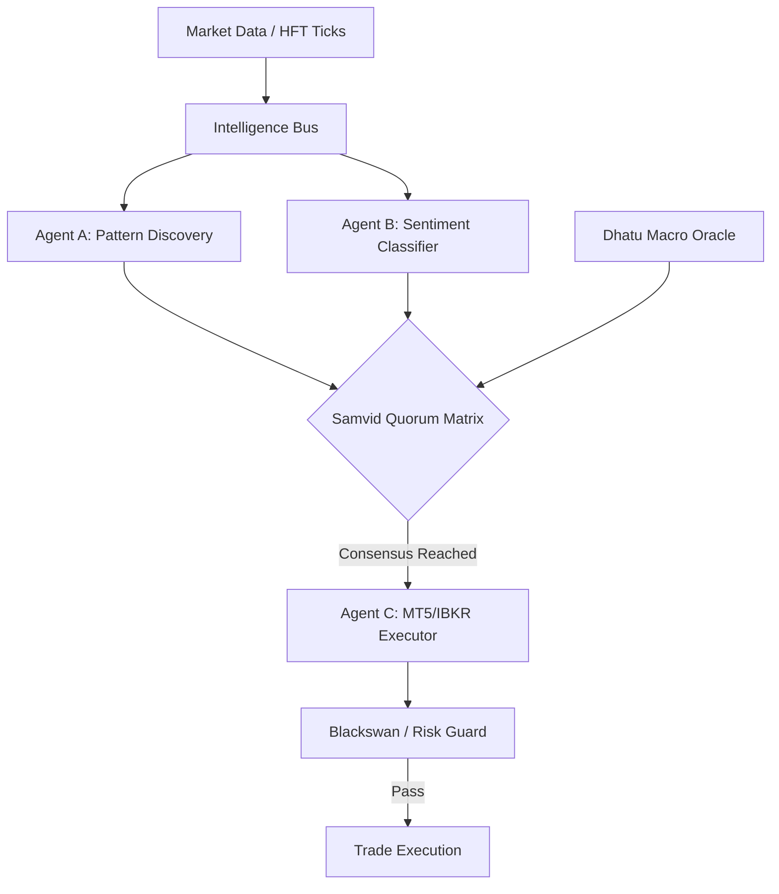

# 🪐 Samvid Trading Core (संविद्)

[](https://github.com/AshishTalpada/samvid-trading-core/actions)
[](https://github.com/AshishTalpada/samvid-trading-core)
[](https://www.python.org/downloads/)
[](https://reactjs.org/)

**Status: Active Development | Core Agent Mesh Functional | Dashboard Telemetry Active**

**Samvid** (Sanskrit for *Consensus* or *Shared Intelligence*) is an experimental, event-driven trading engine. It utilizes a decentralized mesh of specialized agents that collaborate via a consensus-based voting model to manage trade discovery, macro-analysis, and risk-managed execution.

---

## ⚡ Technical Highlights

*   **Autonomous Agent Mesh**: A decentralized coordination layer where 11 specialized entities (Pattern Atlas, Belief Tracker, etc.) vote on trade signals via an internal Intelligence Bus.
*   **Dhatu Macro Oracle**: A causation engine mapping relationships between global yields, volatility (VIX), and energy prices to determine real-time market bias.
*   **Real-time Telemetry**: High-frequency React dashboard providing sub-100ms updates via secured WebSockets and HMAC-SHA256 handshakes.
*   **Security Architecture**: OS-level secure vault for credential management (keyring-based) and automated safety protocols including Blackswan freezes.

---

## 🏗️ Technical Architecture



---

## 🛠️ Technology Stack

| Layer | Technology |
| :--- | :--- |
| **Backend** | Python 3.10+ (Asyncio), FastAPI, Uvicorn |
| **Frontend** | React 18, Vite, Framer Motion, Lightweight Charts |
| **Databases** | QuestDB (Time-series Ticks), SQLite3 (System State) |
| **Security** | OS Vault (keyring), HMAC-SHA256, WebSocket Handshake |

---

## 🚀 Getting Started

### 1. Installation
```bash
# Clone the repository
git clone https://github.com/AshishTalpada/samvid-trading-core.git
cd samvid-trading-core

# Setup Python Environment
python -m venv venv
source venv/bin/activate  # Windows: venv\Scripts\activate
pip install -r requirements.txt

# Setup Dashboard
cd frontend
npm install
```

### 2. Secure Configuration
Samvid utilizes local OS-level credential storage. **No API keys are stored in plaintext.**
```bash
python vault_setup.py
```

### 3. Execution
```bash
# Start Backend
python src/main.py

# Start Frontend (in /frontend)
npm run dev
```

---

## 📂 Project Structure

```text
├── src/                    # Backend Core logic & Intelligence Bus
│   ├── brain.py            # Central Neural Coordinator
│   ├── dhatu_oracle.py     # Macro Causation state-machine
│   └── vault.py            # Keyring-based security bridge
├── frontend/               # React Dashboard (Telemetry & Visualization)
├── tests/                  # Unit and integration testing suite
├── data/                   # Persistent storage (Git ignored)
└── README.md               # Documentation
```

---

**Disclaimer**: *This project is for educational and research purposes. Algorithmic trading involves substantial risk of loss. Use responsibly.*
