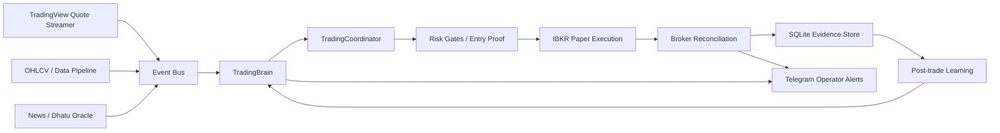
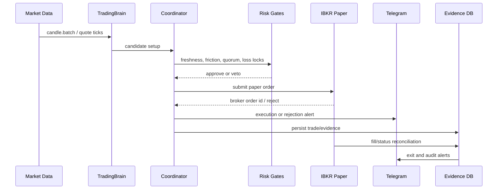

# Samvid Trading Core

[](https://github.com/AshishTalpada/samvid-trading-core/actions/workflows/main.yml)
[](https://github.com/AshishTalpada/samvid-trading-core/actions/workflows/quality.yml)


Samvid Trading Core is a backend-first AI trading system for Interactive Brokers paper trading, real-time market-data monitoring, execution safety, risk controls, trade reconciliation, and Telegram operator alerts.

It is designed for serious algorithmic trading research where every broker order, rejection, exit, risk lock, and runtime fallback must be visible and auditable.

> This is research and engineering software, not financial advice. Use `TRADING_MODE=ibkr_paper` for broker-connected paper execution. Live trading requires independent validation, broker permissions, compliance review, and capital-risk controls.

## Search Keywords

AI trading system, algorithmic trading bot, Interactive Brokers trading bot, IBKR paper trading bot, TradingView quote streamer, Python quantitative trading platform, automated trading backend, multi-agent trading AI, Telegram trading alerts, broker reconciliation engine, real-time market data pipeline, risk managed trading system, paper trading framework.

## Current Operating Modes

| Mode | Broker connection | Orders sent | Intended use |
| --- | --- | --- | --- |
| `paper` | No IBKR broker connection | Internal simulated paper orders only | Safe local smoke tests |
| `ibkr_paper` | IBKR TWS / Gateway paper account | Real paper-account orders | Primary operational mode |
| `live` | IBKR live account when explicitly allowed | Real live orders | Disabled unless `ALLOW_FORCE_LIVE=1` |

Recommended operational paper setup:

```powershell
$env:TRADING_MODE = "ibkr_paper"
$env:ALLOW_FORCE_LIVE = "0"
$env:SOVEREIGN_TV_QUOTES_ENABLED = "1"
$env:SOVEREIGN_IBKR_HFT_ENABLED = "0"
uv run python src/main.py
```

This keeps IBKR focused on execution while the TradingView quote streamer supplies the faster quote lane.

## System Snapshot

| Area | Status | Notes |
| --- | --- | --- |
| IBKR paper execution | Active in `ibkr_paper` | Uses TWS/Gateway paper port and broker reconciliation |
| Telegram alerts | Active when credentials exist | Startup, DMS, execution, rejection, exit, and health alerts |
| TradingView quote stream | Configurable | Enabled with `SOVEREIGN_TV_QUOTES_ENABLED=1` |
| MT5 | Optional | Skipped when credentials are missing |
| Native SLM | Optional/fallback | Deterministic fallback is used when native GGUF runtime is unavailable |
| QuestDB | Optional | SQLite remains the durable local execution/evidence store |
| Safety defaults | Active | Live mode is blocked unless explicitly authorized |

## Architecture Picture



## Execution Workflow



## What Makes It Useful

- Broker-connected paper execution through Interactive Brokers.
- Entry proof gate that blocks stale-data orders.
- TradingView realtime quote lane for faster market updates than delayed OHLCV-only paths.
- Telegram notifications with mode, broker, order id, method, pattern, quantity, stop, target, confidence, and reason.
- Broker reconciliation to detect stale, orphaned, rejected, cancelled, or missing orders.
- Consecutive-loss and recovery locks to reduce activity after drawdown events.
- Post-trade learning from `trade.exit` events.
- Startup and live-audit loops for restart stability checks.

## Alerts Operators Should Expect

| Alert type | Trigger | Includes |
| --- | --- | --- |
| Startup | System online | Mode, IBKR, MT5, Dhatu, OpenBB, Native SLM, latency |
| Execution | Broker accepts order | Mode, broker, order id, side/method, pattern, prices, quantity |
| Rejection | Coordinator or broker veto | Symbol, reason, proposal id |
| Exit | Position closes | Strategy, pattern, exit method, price source, net PnL, R multiple |
| DMS | Dead Man Switch status | Execution online/offline and emergency monitor state |
| Health | Runtime degraded | Component fallback, stale data, broker connectivity, recovery lock |

## Comparison

| Capability | Simple retail bot | Samvid Trading Core | Hedge-fund production stack |
| --- | --- | --- | --- |
| Broker paper execution | Often basic | IBKR paper path with reconciliation | Multi-prime broker stack |
| Data freshness gate | Rare | Required for broker-paper entries | Required, multi-feed validated |
| Operator alerting | Basic fills only | Telegram startup/execution/reject/exit/status | NOC/SRE dashboards and paging |
| Risk locks | Static stop loss | Drawdown, loss streak, recovery, entry proof | Portfolio VaR, stress, exposure, compliance |
| Audit trail | Logs only | SQLite evidence, decision rejection records, order snapshots | Immutable event store and compliance archive |
| Production readiness | Hobby | Serious solo research backend | Institutional, staffed, audited infrastructure |

## Repository Map

| Path | Purpose |
| --- | --- |
| `src/main.py` | Startup, mode safety, broker connections, watchdogs, notifications |
| `src/brain.py` | Main trading state machine and scan loop |
| `src/coordinator.py` | Entry quorum, risk gates, broker routing, execution alerts |
| `src/agent_c_ibkr.py` | IBKR order placement, audit, reconciliation, paper/live safeguards |
| `src/brain_position.py` | Position monitoring, exits, trade-finalization alerts |
| `src/brain_reconcile.py` | Broker/database state reconciliation |
| `src/data_pipeline.py` | OHLCV, market data, news, and fallback ingestion |
| `src/tv_quote_streamer.py` | TradingView quote stream ingestion |
| `src/telegram_alerts.py` | Telegram alert transport and rate limiting |
| `scripts/live_audit_loop.py` | Kill/restart audit runner and log summarizer |
| `tests/` | Unit, integration, startup, risk, execution, and reconciliation tests |

## Setup

Install dependencies:

```bash
uv sync
```

Run verification:

```bash
uv run ruff check src/ tests/ scripts/ --output-format=github
uv run python -m compileall -q src tests
uv run python -m pytest tests -q
```

Validate startup:

```bash
uv run python scripts/startup_validation.py
```

Run a short restart audit:

```bash
uv run python scripts/live_audit_loop.py --cycles 1 --duration 35
```

## Environment Variables

| Variable | Purpose |
| --- | --- |
| `TRADING_MODE` | `paper`, `ibkr_paper`, or `live` |
| `ALLOW_FORCE_LIVE` | Must be `1` before live mode can run |
| `SOVEREIGN_TV_QUOTES_ENABLED` | Enables the TradingView quote lane |
| `SOVEREIGN_IBKR_HFT_ENABLED` | Enables IBKR as tick fallback, usually off when TV quotes are active |
| `SOVEREIGN_ENTRY_DATA_PROOF_MAX_AGE_SEC` | Max age for entry freshness proof |
| `SOVEREIGN_PAPER_EXPLORATION` | Allows tiny broker-paper learning orders on high-quality near misses |
| `TELEGRAM_BOT_TOKEN` | Telegram bot token |
| `TELEGRAM_CHAT_ID` | Telegram destination chat id |
| `IB_HOST` | IBKR host, usually `127.0.0.1` |
| `IB_PORT` | IBKR paper port, usually `7497` |

## Honest Production Position

Samvid Trading Core is not a hedge-fund production platform. It is a serious solo trading-system backend with broker-paper execution, risk gates, observability, and auditability moving in that direction.

To move closer to institutional quality, the system still needs:

- Longer live-market IBKR paper soak tests.
- Verified positive expectancy after commission, slippage, rejects, and stale-data blocks.
- Multi-session reconciliation reports with no unexplained broker drift.
- Stronger data-provider redundancy.
- Full native SLM runtime stability or explicit removal from critical path.
- Better external monitoring beyond local logs and Telegram.

## License

MIT License.

## Disclaimer

Trading can lose money quickly. You are responsible for broker permissions, exchange rules, taxes, compliance, strategy validation, risk controls, and all decisions made with this software.
