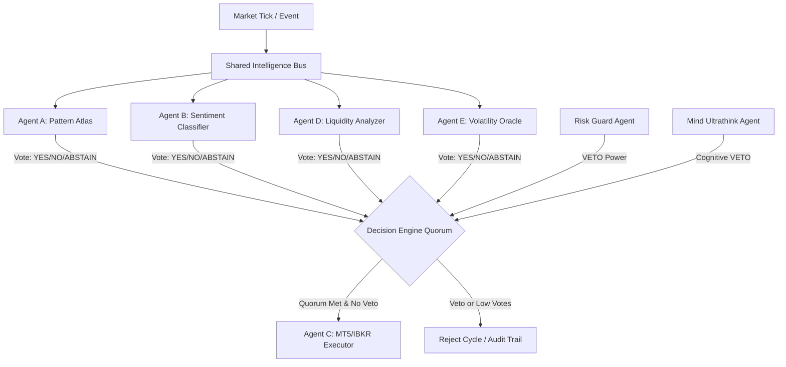

# Samvid Trading Core Architecture Document

This document provides a comprehensive overview of the architectural paradigms powering the **Samvid Trading Core**, specifically detailing the **Autonomous Agent Mesh Consensus** and the **Dhatu Macro-Causation Regime Classifier**.

---

## 1. Decentralized Agent-Mesh Consensus

Rather than relying on a single monolithic strategy model, Samvid uses a consensus-based swarm paradigm. Trade ideas and executions are evaluated through a distributed network of specialized agents.

### The Quorum Protocol

Trade signals are generated and submitted by individual agents, but no action is taken unless a strict quorum is met. The **Decision Engine** (`src/decision_engine.py`) acts as the singular gateway for execution:



### Key Consensus Rules & Safeguards

1. **Mandatory Agents Check**: The cycle enforces that all core agents (`Agent_A` to `Agent_G`, `Risk_Guard`, `Dhatu_Oracle`, `Swarm_Predictor`, `Mind_Ultrathink`) have submitted their evaluations.
2. **Drift & Latency Isolation**: If an agent experiences processing latency resulting in timestamp drift greater than 60 seconds, its vote is excluded from the quorum to avoid using stale intelligence.
3. **The Risk Veto**: The `Risk_Guard` agent possesses an absolute veto. Regardless of the consensus ratio or average confidence, a `NO` vote from `Risk_Guard` immediately terminates the execution cycle.
4. **Cognitive Veto**: The `Mind_Ultrathink` LLM agent can issue cognitive vetoes based on macro context discrepancies.
5. **Adaptive Quorum Thresholds**:
   - **Normal Mode**: Requires a minimum of 5 `YES` votes and $\ge 60\%$ of active voters, with average confidence $\ge 0.60$.
   - **Choppy/Volatile Regimes**: Threshold is dynamically lowered to 4 `YES` votes to capture swift mean-reversions, but sizing is scaled down.
   - **Safe Mode**: Requires a strict $50\%$ approval of total registered agents and $\ge 0.70$ confidence.
6. **Edge Crowding Protective Shield**: If `Agent_D` detects high retail/institutional crowding (M-05), the execution mode is upgraded to **Ghost Expansion** (adjusting stop multipliers by $+35\%$ and reducing sizing by $-25\%$).

---

## 2. Dhatu Macro-Causation Regimes

**Project Dhatu** represents the macro intelligence layer. It maps global causal factors (extracted from news, yields, VIX, commodity feeds, and alternative datasets) into dynamic regimes.

### Regime Taxonomy & Action Protocols

Market behavior is classified into 8 core states, governed by the `DHATU_PROTOCOL_MAP` (`src/dhatu_oracle.py`):

| Dhatu State | Action Protocol | Risk Modifier | Description & Triggering Catalysts |
| :--- | :--- | :--- | :--- |
| **Vriddhi** | `MAX_RISK` | `1.50` | Growth phase. Triggered by falling yields, robust grid demand, index expansion. |
| **Samyoga** | `AGGRESSIVE_LONG`| `1.25` | Conjunction of positive macro forces. Full technical triggers active. |
| **Sthira** | `NORMAL` | `1.00` | Stability. Range-bound macro. Standard mean-reversion focus. |
| **Sthiti** | `HOLD` | `0.95` | Persistence of existing state. Maintain ongoing postures. |
| **Chala** | `REDUCE` | `0.50` | High Volatility. Wide swings. Reduced sizing, wider risk bounds. |
| **Kshaya** | `SHORT_HEDGE` | `0.25` | Decay. Heavy supply chain shocks, cyber threats to infrastructure. Short bias. |
| **Viyoga** | `FLATTEN` | `0.00` | Separation. Heavy geopolitical friction. Liquidation of equities; long gold/raw assets. |
| **Abhava** | `CASH` | `0.00` | Absence of market direction or extreme tail hazard. Complete capital lockdown. |

### The Concept of Abhava (Tracking Absences)
Unlike traditional quantitative models that focus entirely on the presence of volatility or volumes, Dhatu tracks **Abhava** (what is absent from the market). The absence of standard liquidity profiles, default counterparty responses, or expected buying volumes in a rising market are logged as indicators of fragility, prompting early shifts to cash.

---

## 3. High-Performance Hybrid Architecture (Rust & C/C++)

To achieve institutional-grade throughput, Samvid utilizes a hybrid runtime model. The execution control loops are coordinated using Python's asynchronous event framework (`asyncio`), while performance-critical computation is offloaded to systems languages:

```
┌────────────────────────────────────────────────────────┐
│               Python Orchestration Layer               │
│    - Asynchronous Event Bus (SharedIntelligenceBus)    │
│    - API Server & Decision Engine Quorum Logic         │
└───────────────────────────┬────────────────────────────┘
                            │ PyO3 / Numba JIT / Cython
┌───────────────────────────▼────────────────────────────┐
│              Systems Execution Acceleration            │
│  - Rust Modules (Order Signer, LOB Arbitrage Core)     │
│  - C Engine (Memory-Mapped Order Book, Raw Structs)    │
│  - CUDA Kernels (Parallel SLM Token & Embeddings JIT)  │
└────────────────────────────────────────────────────────┘
```

### Rust for Critical Loops
- **Arbitrage Execution (`src/arbitrage.rs`)**: High-speed multi-leg asset price routing and arbitrage identification loops run in multi-threaded Rust.
- **Micro Arbs (`src/micro_arb.rs`)**: Sub-millisecond spread monitoring.
- **Order Signing & Encryption (`src/order_signer.rs`)**: Cryptographic signature validation and secure message framing are executed in Rust for thread safety and speed.

### C/C++ for Ingestion and Parsing
- **Order Book Parser (`src/order_book.c`)**: Raw market data feed packet parser, utilizing memory alignment and preallocated arrays to handle up to 500,000 updates/second without garbage collection latency.
- **Hardware Integration (`src/hardware_audit.c`)**: Inspects direct host processor registers (AVX/SIMD capabilities) to ensure optimal binary instructions are deployed dynamically.
